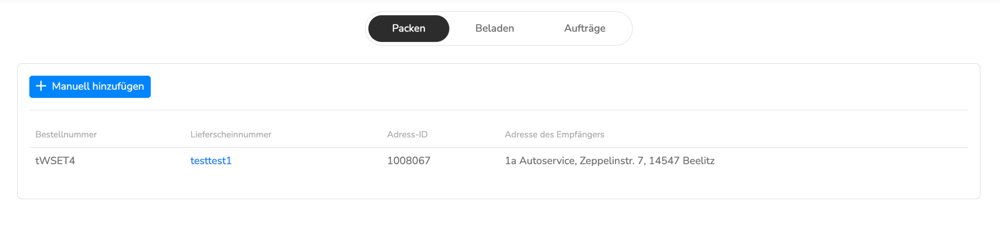
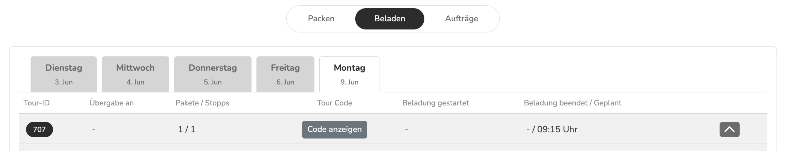

# Style Guide – tiramizoo LMM Modul Landing Pages

Wiederverwendbarer Style Guide für Landing Pages der Last Mile Master (LMM) Module. Basierend auf der finalen Umsetzung der ALV Landing Page, ausgerichtet an der Packstation-Referenzseite.

**Referenz-Vorlage:** [`Website_Sample.pdf`](./Website_Sample.pdf) – visuelle Vorlage für Layout, Sektionsreihenfolge und Designentscheidungen.

---

## Gesamteindruck

Minimalistisch, clean, vertrauensbildend. Viel Weißraum, reduzierte Farbpalette, klare Hierarchie. Der Stil vermittelt **Professionalität ohne Komplexität** – passend für ein B2B-SaaS-Produkt, das Einfachheit verspricht.

---

## Farbpalette

### CSS Custom Properties

```css
:root {
  --color-text-primary:   #1A1A1A;
  --color-text-secondary: #6B7280;
  --color-text-muted:     #9CA3AF;
  --color-bg:             #FFFFFF;
  --color-bg-alt:         #F9FAFB;
  --color-border:         #E5E7EB;
  --color-accent:         #009FE3;        /* tiramizoo Cerulean – CTAs */
  --color-accent-hover:   #0087c4;
  --color-success:        #92BB44;        /* tiramizoo Grün – Checkmarks, Pill-Badge */
  --color-danger:         #EF4444;
  --color-star:           #F59E0B;
}
```

| Verwendung | Farbe | CSS Variable |
|---|---|---|
| **Primär-Text** | `#1A1A1A` | `--color-text-primary` |
| **Sekundär-Text** | `#6B7280` | `--color-text-secondary` |
| **Gedämpfter Text** | `#9CA3AF` | `--color-text-muted` |
| **Hintergrund** | `#FFFFFF` | `--color-bg` |
| **Hintergrund alternierend** | `#F9FAFB` | `--color-bg-alt` |
| **Border / Divider** | `#E5E7EB` | `--color-border` |
| **CTA / Akzent** | `#009FE3` | `--color-accent` |
| **Erfolg / Grün** | `#92BB44` | `--color-success` |
| **Fehler / Rot** | `#EF4444` | `--color-danger` |

### Farbprinzipien
- `body` hat `color: var(--color-text-secondary)` als Standard — **nicht** primary
- `#009FE3` für alle primären CTA-Buttons
- `#92BB44` sparsam: Checkmarks, Erfolgs-Badges, Pill-Badge im Hero
- `#EF4444` für Fehler-Ikons in der Vorher/Nachher-Sektion
- Zweite Zeile einer Headline in Grau (`<span class="muted">`) für Kontrast-Effekt

---

## Typografie

### Font
- **Familie:** Inter (Google Fonts CDN)
- **Fallback:** -apple-system, BlinkMacSystemFont, 'Segoe UI', sans-serif
- **Sprache:** Deutsch – echte Umlaute verwenden (ä, ö, ü, ß)

### Größen

```css
--fs-hero:   clamp(2.5rem, 6vw, 4.5rem);
--fs-h2:     clamp(2rem, 4vw, 3rem);
--fs-h3:     clamp(1.25rem, 2vw, 1.5rem);
--fs-body:   1.0625rem;
--fs-small:  0.875rem;
--fs-label:  0.8125rem;
```

### Gewichte

```css
--fw-regular:   400;   /* Body Text */
--fw-medium:    500;   /* Labels, Pill-Text, Nav-Links */
--fw-semibold:  600;   /* Card-Titel, Buttons */
--fw-bold:      700;   /* Section Headlines */
--fw-extrabold: 800;   /* Stats-Zahlen */
--fw-black:     900;   /* Hero Headline, Pricing */
```

### Zeilenabstand & Spacing

```css
--lh-tight:  1.08;    /* Headlines */
--lh-snug:   1.25;    /* Card-Titel */
--lh-normal: 1.6;     /* Body Text */
--ls-tight:  -0.025em; /* Headlines */
--ls-wide:   0.1em;   /* Uppercase Labels */
```

### Headline-Muster (Schwarz/Grau-Trick)
```html
<h2 class="headline headline--section">
  Erste Zeile schwarz.<br>
  <span class="muted">Zweite Zeile grau.</span>
</h2>
```
Alle `.headline` Elemente: `font-weight: var(--fw-black)`, `color: var(--color-text-primary)`.

---

## Layout & Spacing

### Container
```css
--max-width:       1200px;
--section-padding: clamp(4rem, 10vw, 8rem);
--card-radius:     12px;
```
- Container: `max-width: 1200px`, `padding: 0 1.5rem`, zentriert
- Alternierende Hintergründe: Weiß / `#F9FAFB` im Wechsel

### Responsive Breakpoints
- **Einziger Breakpoint:** `768px` (mobile → desktop)
- Mobile-First: Basis-Styles für Mobile, `@media (max-width: 768px)` für Korrekturen

---

## Komponenten

### 1. Navigation (Sticky Header)

**HTML-Struktur:**
```html
<nav class="nav">
  <div class="container">
    <div class="nav__inner">
      <div class="nav__logo"></div>
      <div class="nav__links">
        <a href="#funktionen">Vorteile</a>
        <a href="#prozess">So einfach geht's</a>
        <a href="#pricing">Preise</a>
        <a href="#faq">FAQ</a>
      </div>
      <a href="mailto:..." class="btn btn--primary nav__cta">Präsentation anfragen</a>
      <button class="nav__burger" aria-label="Menü öffnen" aria-expanded="false">
        <span></span><span></span><span></span>
      </button>
    </div>
  </div>
  <div class="nav__mobile">
    <a href="#funktionen">Vorteile</a>
    ...
    <a href="mailto:..." class="btn btn--primary" style="text-align:center;">Präsentation anfragen</a>
  </div>
</nav>
```

**Wichtige CSS-Details:**
```css
.nav { position: sticky; top: 0; background: rgba(255,255,255,0.95); backdrop-filter: blur(12px); }
.nav__inner { height: 64px; display: flex; align-items: center; }
.nav__links { margin-left: auto; } /* links rechts ausrichten */
.nav__cta { margin-left: 1rem; font-size: var(--fs-small); padding: 0.5rem 1.25rem; }
.nav__burger { display: none; }

/* Mobile: */
@media (max-width: 768px) {
  .nav__links, .nav__cta { display: none; }
  .nav__burger { display: flex; margin-left: auto; } /* Burger rechts! */
}

/* WICHTIG: Mobile Nav Button-Override */
.nav__mobile a { color: var(--color-text-secondary); }
.nav__mobile a.btn--primary { color: #fff; } /* Sonst überschreibt nav__mobile a den weißen Text */
```

**Logo:** tiramizoo SVG muss `fill="#1A1A1A"` haben (nicht weiß/transparent).

---

### 2. Hero Section

**HTML-Struktur (3 separate Grid-Kinder):**
```html
<section class="hero">
  <div class="container">
    <div class="hero__inner">

      <!-- Grid-Kind 1: Text (ohne Buttons) -->
      <div class="hero__content">
        <div class="hero__badge"><span class="pill pill--filled">...</span></div>
        <h1 class="headline headline--hero hero__headline">...</h1>
        <p class="hero__sub">...</p>
        <div class="hero__badges">
          <span class="hero__badge-item"><svg/>Text</span>
        </div>
      </div>

      <!-- Grid-Kind 2: Bild -->
      <div class="hero__visual reveal">
        
        <div class="hero__toast">...</div>
      </div>

      <!-- Grid-Kind 3: CTAs (separat, damit auf mobile UNTER dem Bild) -->
      <div class="hero__ctas">
        <a href="mailto:..." class="btn btn--primary">...</a>
        <a href="#problem" class="btn btn--outline">...</a>
      </div>

    </div>
  </div>
</section>
```

**WICHTIG:** `hero__ctas` muss ein direktes Kind von `hero__inner` sein – **nicht** innerhalb von `hero__content`. Nur so kann auf mobile die Reihenfolge Text → Bild → Buttons per CSS `order` gesteuert werden.

**CSS – Desktop (3-Kind-Grid):**
```css
.hero__inner {
  display: grid;
  grid-template-columns: 1fr 1fr;
  grid-template-rows: auto auto;
  gap: 2rem 4rem;
  align-items: start;
}
.hero__content { grid-column: 1; grid-row: 1; }
.hero__visual  { grid-column: 2; grid-row: 1 / 3; align-self: center; } /* spannt beide Reihen */
.hero__ctas    { grid-column: 1; grid-row: 2; }
```

**CSS – Mobile:**
```css
@media (max-width: 768px) {
  .hero__inner { grid-template-columns: 1fr; grid-template-rows: auto; gap: 2rem; }
  .hero__content { grid-column: 1; grid-row: auto; order: 1; }
  .hero__visual  { grid-column: 1; grid-row: auto; order: 2; } /* Bild unter Text */
  .hero__ctas    { grid-column: 1; grid-row: auto; order: 3; } /* Buttons unter Bild */
  .hero__toast   { bottom: -1rem; left: 0.5rem; }
}
```

**Toast-Overlay:**
```css
.hero__toast { position: absolute; top: -1rem; right: -1rem; background: #fff;
  border-radius: 10px; box-shadow: var(--shadow-md); padding: 0.75rem 1rem;
  font-size: var(--fs-small); border: 1px solid var(--color-border); }
.hero__toast-icon { width: 32px; height: 32px; background: rgba(146,187,68,0.12);
  border-radius: 8px; color: var(--color-success); }
```

---

### 3. Vergleichssektion (Vorher/Nachher)

**Layout:** Flaches 2-Spalten CSS Grid mit 6 direkten Kindern (3 Reihen × 2 Spalten). Keine Card-Wrapper.

**HTML-Struktur:**
```html
<section class="comparison" id="problem">
  <div class="container">
    <div class="comparison__header reveal">
      <span class="pill">Das Problem</span>
      <h2 class="headline headline--section">...</h2>
      <p>...</p>
    </div>

    <div class="comparison__body reveal">

      <!-- Reihe 1: Labels -->
      <span class="comparison__label comparison__label--before">
        <svg><!-- X-Icon --></svg> Heute – Manuell auf Papier
      </span>
      <span class="comparison__label comparison__label--after">
        <svg><!-- Check-Icon --></svg> Morgen – Digital & Optimiert mit ALV
      </span>

      <!-- Reihe 2: Bilder -->
      <div class="comparison__img-wrap comparison__img-wrap--before">
        <!-- SVG Papier-Illustration oder echtes Bild -->
      </div>
      <div class="comparison__img-wrap comparison__img-wrap--after">
        
      </div>

      <!-- Reihe 3: Listen -->
      <div class="comparison__list comparison__list--before">
        <div class="comparison__item comparison__item--negative">
          <svg stroke="#EF4444"><!-- X --></svg> Problemtext
        </div>
      </div>
      <div class="comparison__list comparison__list--after">
        <div class="comparison__item comparison__item--positive">
          <svg stroke="#92BB44"><!-- Check --></svg> Lösungstext
        </div>
      </div>

    </div>
  </div>
</section>
```

**CSS:**
```css
.comparison__body {
  display: grid;
  grid-template-columns: 1fr 1fr;
  gap: 0 2rem;
  margin-top: 3rem;
}

.comparison__label {
  display: flex; align-items: center; gap: 0.5rem;
  font-size: var(--fs-small); font-weight: var(--fw-semibold);
  text-transform: uppercase; letter-spacing: var(--ls-wide);
  padding-bottom: 0.75rem; margin-bottom: 1.25rem;
  border-bottom: 2px solid; /* Farbe per Modifier */
}
.comparison__label--before { color: var(--color-danger);  border-bottom-color: var(--color-danger); }
.comparison__label--after  { color: var(--color-success); border-bottom-color: var(--color-success); }

.comparison__img-wrap {
  aspect-ratio: 10 / 6; border-radius: 8px;
  border: 1px solid var(--color-border); box-shadow: var(--shadow-sm);
  overflow: hidden; margin-bottom: 1.5rem;
}
.comparison__img-wrap--before { opacity: 0.85; }
.comparison__screenshot { width: 100%; height: 100%; object-fit: cover; object-position: top left; }

.comparison__list {
  display: flex; flex-direction: column;
  background: var(--color-bg); border: 1px solid var(--color-border);
  border-radius: 12px; padding: 1.25rem;
}
.comparison__list--after { border-color: var(--color-success); }

.comparison__item {
  display: flex; align-items: flex-start; gap: 0.625rem;
  padding: 0.625rem 0; border-bottom: 1px solid var(--color-border);
  font-size: var(--fs-small); line-height: var(--lh-snug);
}
.comparison__item:last-child { border-bottom: none; }
.comparison__item svg { flex-shrink: 0; margin-top: 2px; }

/* Mobile: thematisch gruppieren per CSS order */
@media (max-width: 768px) {
  .comparison__body         { grid-template-columns: 1fr; }
  .comparison__label--before  { order: 1; }
  .comparison__img-wrap--before { order: 2; }
  .comparison__list--before   { order: 3; }
  .comparison__label--after   { order: 4; }
  .comparison__img-wrap--after { order: 5; }
  .comparison__list--after    { order: 6; }
}
```

---

### 4. Feature Cards (3×2 Grid)

```css
.features__grid { display: grid; grid-template-columns: repeat(3, 1fr); gap: 1.5rem; }
.feature-card { border: 1px solid var(--color-border); border-radius: var(--card-radius); padding: 2rem; }
.feature-card__icon { color: var(--color-text-primary); /* NICHT accent/blau */ }
.feature-card__title { font-weight: var(--fw-bold); }
.feature-card__desc { font-size: var(--fs-small); color: var(--color-text-secondary); }

@media (max-width: 768px) {
  .features__grid { grid-template-columns: 1fr; }
}
```

---

### 5. Prozess-Schritte (Alternierend)

**Layout:** Text und Bild nebeneinander, jede zweite Reihe gespiegelt via `direction: rtl`.

```css
.prozess__step-alt {
  display: grid;
  grid-template-columns: 1fr 1fr;
  gap: 4rem;
  align-items: center;
}
.prozess__step-alt--reverse { direction: rtl; }
.prozess__step-alt--reverse > * { direction: ltr; }

/* Mobile: Bild UNTER dem Text */
@media (max-width: 768px) {
  .prozess__step-alt { grid-template-columns: 1fr; }
  .prozess__step-alt--reverse { direction: ltr; }
  .prozess__step-alt__visual { order: 1; } /* NICHT order: -1 – sonst erscheint Bild oben */
}
```

---

### 6. Stats / Kennzahlen

```css
.stats__grid { display: grid; grid-template-columns: repeat(4, 1fr); gap: 2rem; }
.stats__number { font-size: clamp(1.75rem, 3vw, 2.25rem); font-weight: var(--fw-extrabold); color: var(--color-text-primary); }
.stats__label  { font-size: var(--fs-small); color: var(--color-text-secondary); }
.stats__subtitle { margin-top: 0.5rem; font-size: var(--fs-small); font-weight: var(--fw-semibold); color: var(--color-text-secondary); }

@media (max-width: 768px) {
  .stats__grid { grid-template-columns: repeat(2, 1fr); }
}
```

**Pattern:** Pill-Label „In Zahlen" → Headline „Messbar besser." → Subtitle „Bis zu:" → Stats-Grid

---

### 7. Pricing Section

```css
.pricing__card { border: 2px solid var(--color-accent); border-radius: 16px; padding: 2.5rem; }
```
Preis: `--fw-black`, groß. Feature-Liste mit Checkmarks. CTA-Button am Ende.

---

### 8. FAQ Accordion

```css
.faq__question { cursor: pointer; transition: color 0.2s; }
.faq__question:hover { color: var(--color-accent); } /* Hover: blau */
.faq__answer { max-height: 0; overflow: hidden; transition: max-height 0.3s ease; }
.faq__item.is-open .faq__answer { max-height: [scrollHeight]px; } /* per JS gesetzt */
```
Nur ein Item gleichzeitig offen (JS schließt alle anderen beim Öffnen).

---

### 9. Final CTA Section

```css
.cta-final { background: #1A1A1A; color: #fff; }
/* Buttons: btn--primary (#009FE3) + btn--outline-white */
```

---

### 10. Buttons

```css
.btn {
  padding: 0.75rem 1.75rem;
  border-radius: 10px;
  font-weight: var(--fw-semibold);
  border: 1px solid transparent;
}
.btn--primary { background: var(--color-accent); color: #fff; }
.btn--primary:hover { background: var(--color-accent-hover); }
.btn--outline { background: transparent; color: var(--color-text-primary); border-color: var(--color-border); }
.btn--outline-white { color: #fff; border-color: rgba(255,255,255,0.4); } /* Für dunkle Hintergründe */
```

---

### 11. Pill / Chip Badges

```css
.pill         { border: 1px solid var(--color-border); color: var(--color-text-secondary); }
.pill--filled { background: var(--color-success); border-color: var(--color-success); color: #fff; }
.pill--success { background: rgba(146,187,68,0.1); border-color: var(--color-success); color: #5a8a1a; }
```

---

### 12. Scroll Reveal Animation

```css
.reveal { opacity: 0; transform: translateY(24px); transition: opacity 0.6s ease, transform 0.6s ease; }
.reveal.is-visible { opacity: 1; transform: translateY(0); }
```
JS: `IntersectionObserver` mit `threshold: 0.12`, `observer.unobserve` nach erstem Einblenden.

---

## Sektionsreihenfolge

1. **Navigation** (sticky)
2. **Hero** – Headline, Bild, CTAs
3. **Problem/Lösung** (Vorher/Nachher Vergleich)
4. **Features** (Feature Cards Grid)
5. **Prozess** (Alternierende Schritte)
6. **Stats** (Kennzahlen)
7. **Pricing** (Preise / CTA-Karte)
8. **FAQ** (Accordion)
9. **Final CTA** (dunkler Hintergrund)
10. **Footer**

---

## Mobile-First: Kritische Regeln

| Element | Falsch | Richtig |
|---|---|---|
| Hero Bild | `order: -1` (Bild oben) | `order: 2` (Bild unter Text) |
| Hero CTAs | In `hero__content` verschachtelt | Eigenes Grid-Kind `hero__ctas` mit `order: 3` |
| Prozess Bilder | `order: -1` (Bild oben) | `order: 1` (Bild unter Text) |
| Vergleich | Einfaches 1-Spalten-Grid | CSS `order` 1–6 für thematische Gruppierung |
| Hamburger | Folgt direkt auf Logo | `margin-left: auto` → rechts ausgerichtet |
| Mobile Nav Button | Erbt grau von `nav__mobile a` | `.nav__mobile a.btn--primary { color: #fff; }` |

---

## JavaScript (main.js)

```js
// Sticky Nav Shadow
window.addEventListener('scroll', () => nav.classList.toggle('is-scrolled', scrollY > 10));

// Mobile Nav Toggle
burger.addEventListener('click', () => {
  const open = mobileNav.classList.toggle('is-open');
  burger.setAttribute('aria-expanded', open);
});

// Scroll Reveal
new IntersectionObserver((entries) => {
  entries.forEach(e => { if (e.isIntersecting) { e.target.classList.add('is-visible'); observer.unobserve(e.target); }});
}, { threshold: 0.12 });

// FAQ Accordion
// Alle schließen, dann geklicktes öffnen (max-height = scrollHeight)

// Smooth Scroll mit Nav-Offset
const top = target.getBoundingClientRect().top + scrollY - navHeight - 16;
window.scrollTo({ top, behavior: 'smooth' });
```

---

## Dateistruktur

```
/landing-page/
├── index.html
├── css/
│   └── styles.css
├── js/
│   └── main.js
├── images/
│   ├── image1.png   (Hero – Packen-Ansicht)
│   ├── image2.png   (Vergleich – Beladen-Ansicht)
│   └── [weitere Screenshots].png
├── tiramizoo-logo.svg   (fill="#1A1A1A" – schwarz, nicht weiß!)
├── .gitignore
└── content-audit.md
```

### .gitignore (immer anlegen)
```
.DS_Store
*.DS_Store
.claude/
~$*
*.docx
*.pptx
*.pdf
landing-page-prompt.md
```

---

## Wiederkehrende Design-Patterns

1. **Schwarz/Grau-Headlines:** Erste Zeile schwarz, zweite Zeile grau (`<span class="muted">`)
2. **Pill-Labels über Sektionen:** Kontext-Geber vor jeder Headline
3. **App-Mockups mit Toast-Overlays:** Screenshots mit schwebenden Notification-Karten
4. **Inline Trust-Badges:** Checkmark-SVG + Text in `hero__badge-item`
5. **Alternierende Hintergründe:** Sektionen wechseln zwischen `#fff` und `#F9FAFB`
6. **Mailto-CTAs:** Vorbefüllte E-Mails (Subject + Body) statt Formular-Backend
7. **Großzügiger Weißraum:** `clamp(4rem, 10vw, 8rem)` pro Sektion
8. **Nummerierte Prozesse:** Große Zahl + Title + Description + optionaler Screenshot
9. **Stat + Subtitle Pattern:** Pill → Headline → „Bis zu:" Subtitle → Zahlen-Grid
